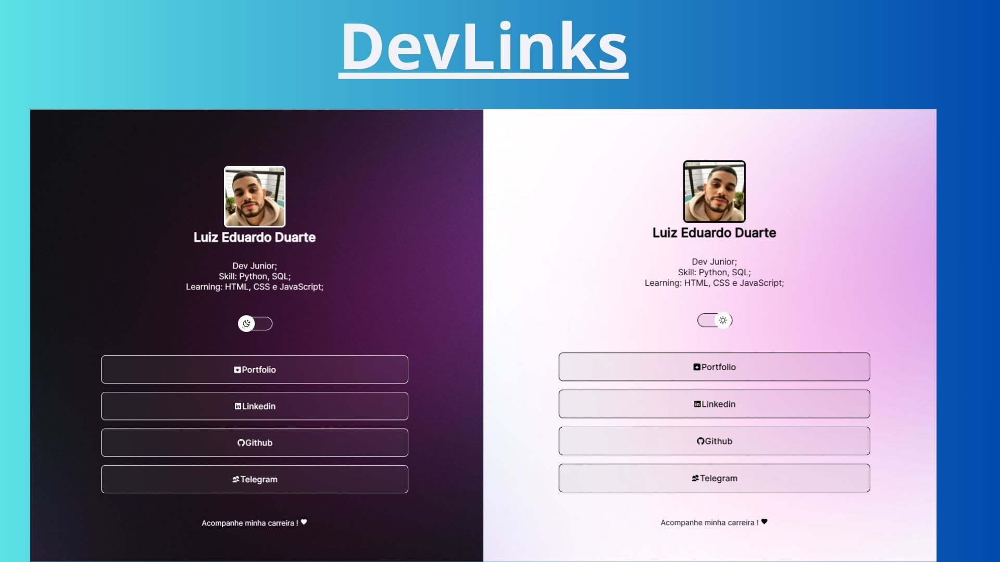

<h1 align="center"> DevLinks </h1>

Projeto com o objetivo de destacar opcoes relevantes, reduzindo a dificuldade de encontrar um determinado assunto.

 

## Tecnologia
Esse projeto foi desenvolvido com as seguintes tecnologias:
- HTML e CSS
- JavaScript
- Git e Github
- Figma

## Projeto
O DevLinks é um agregador de links para usar como cartão de visitas online, que sao conhecido como LinkTree.
- [Acesse o projeto finalizado ](https://github.com/luizeduardoduarte/devlinks)

## Design

  

